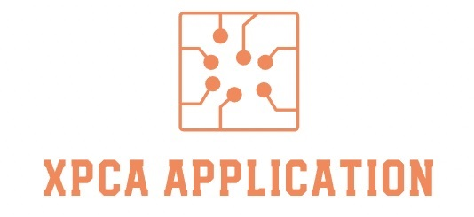

<!-- PROJECT LOGO -->
<br />
<div align="center">
  <a href="https://github.com/ranjeetsn/XPCA_MATLAB_APP">
    
  </a>

  <h3 align="center">XPCA Application MATLAB</h3>

  <p align="center">
    An awesome application to model dynamic and static processes!
    <br />
    <a href="https://github.com/ranjeetsn/XPCA_MATLAB_APP"><strong>Explore the docs »</strong></a>
    <br />
    <br />
    <a href="https://github.com/ranjeetsn/XPCA_MATLAB_APP">View Demo</a>
    ·
    <a href="https://github.com/ranjeetsn/XPCA_MATLAB_APP/issues">Report Bug</a>
    ·
    <a href="https://github.com/ranjeetsn/XPCA_MATLAB_APP/issues">Request Feature</a>
  </p>
</div>


<!-- TABLE OF CONTENTS -->
<details>
  <summary>Table of Contents</summary>
  <ol>
    <li>
      <a href="#about-the-project">About The Project</a>
      <ul>
        <li><a href="#built-with">Built With</a></li>
      </ul>
    </li>
    <li>
      <a href="#getting-started">Getting Started</a>
      <ul>
        <li><a href="#prerequisites">Prerequisites</a></li>
        <li><a href="#installation">Installation</a></li>
      </ul>
    </li>
    <li><a href="#usage">Usage</a></li>
    <li><a href="#roadmap">Roadmap</a></li>
    <li><a href="#contributing">Contributing</a></li>
    <li><a href="#license">License</a></li>
    <li><a href="#contact">Contact</a></li>
    <li><a href="#acknowledgments">Acknowledgments</a></li>
  </ol>
</details>


<!-- ABOUT THE PROJECT -->
## About The Project
[![Product Name Screen Shot][product-screenshot]]()

The XPCA Application, the first of its kind on this platform, is designed primarily for classroom training, academic purposes, Industrial and Commercial Applications. The Toolbox contains options for constructing mathematical data-driven models for Error-in-Variable (EIV) linear-time invariant (LTI) systems for Dynamic Models from measured input-output data as well as Static Models for heteroskedastic error variables. In the present version of the App Toolbox the class of systems are restricted to Single Input Single Output (SISO) Dynamic Systems. The Toolbox is also useful for model validation using bootstrapping for confidence interval calculation and residual analysis using EIV Kalman filter. The App Toolbox has been designed for Novice and Expert User to Estimate and Validate models using multiple options and methods. The Backend of the App Toolbox has been designed in the "Strategic pattern" and "Singleton pattern" such that future developers can plug new options and methods very easily without disturbing the integrity of other components in the Application.

To summarise:
* Model Dynamic and Static processes for EIV data
* Currently only supports SISO dynamic systems
* Uses EIV Kalman Filter for validation and Prediction
* Uses Strategic Pattern architecture

<p align="right">(<a href="#readme-top">back to top</a>)</p>


### Built With
The Application was build on the MATLAB plaform, the User interface was designed was MATLAB App designer as well as on MATLAB GUIDE

* [![Matlab][Matlab.com]][Matlab-url]
* [![Matlab][MatlabApp.com]][MatlabApp-url]
* [![Matlab][Matlabguide.com]][Matlabguide-url]

<p align="right">(<a href="#readme-top">back to top</a>)</p>


<!-- GETTING STARTED -->
## Getting Started


### Prerequisites

To run MATLAB Application the user must have MATLAB installed on their device

* MATLAB
  https://in.mathworks.com/help/install/install-products.html

### Installation

_Below is an example of how you can instruct your audience on installing and setting up your app. This template doesn't rely on any external dependencies or services._

1. Clone the repo
   ```sh
   git clone https://github.com/ranjeetsn/XPCA_MATLAB_APP
   ```

<p align="right">(<a href="#readme-top">back to top</a>)</p>


<!-- USAGE EXAMPLES -->
## Usage

Use this space to show useful examples of how a project can be used. Additional screenshots, code examples and demos work well in this space. You may also link to more resources.

_For more examples, please refer to the [Documentation](https://example.com)_

<p align="right">(<a href="#readme-top">back to top</a>)</p>


<!-- ROADMAP -->
## Roadmap

- [x] Add Changelog
- [x] Add back to top links
- [ ] Add Additional Templates w/ Examples
- [ ] Add "components" document to easily copy & paste sections of the readme
- [ ] Multi-language Support
    - [ ] Chinese
    - [ ] Spanish

See the [open issues](https://github.com/othneildrew/Best-README-Template/issues) for a full list of proposed features (and known issues).

<p align="right">(<a href="#readme-top">back to top</a>)</p>


<!-- CONTRIBUTING -->
## Contributing

Contributions are what make the open source community such an amazing place to learn, inspire, and create. Any contributions you make are **greatly appreciated**.

If you have a suggestion that would make this better, please fork the repo and create a pull request. You can also simply open an issue with the tag "enhancement".
Don't forget to give the project a star! Thanks again!

1. Fork the Project
2. Create your Feature Branch (`git checkout -b feature/AmazingFeature`)
3. Commit your Changes (`git commit -m 'Add some AmazingFeature'`)
4. Push to the Branch (`git push origin feature/AmazingFeature`)
5. Open a Pull Request

<p align="right">(<a href="#readme-top">back to top</a>)</p>


<!-- LICENSE -->
## License

Distributed under the MIT License. See `LICENSE.txt` for more information.

<p align="right">(<a href="#readme-top">back to top</a>)</p>


<!-- CONTACT -->
## Contact

Your Name - [@your_twitter](https://twitter.com/your_username) - email@example.com

Project Link: [https://github.com/your_username/repo_name](https://github.com/your_username/repo_name)

<p align="right">(<a href="#readme-top">back to top</a>)</p>


<!-- ACKNOWLEDGMENTS -->
## Acknowledgments

Use this space to list resources you find helpful and would like to give credit to. I've included a few of my favorites to kick things off!

# XPCA_MATLAB_APP
MATLAB application for XPCA. The user must have MATLAB installed to install the App.


<!-- MARKDOWN LINKS & IMAGES -->
<!-- https://www.markdownguide.org/basic-syntax/#reference-style-links -->
[contributors-shield]: https://img.shields.io/github/contributors/othneildrew/Best-README-Template.svg?style=for-the-badge
[contributors-url]: https://github.com/othneildrew/Best-README-Template/graphs/contributors
[forks-shield]: https://img.shields.io/github/forks/othneildrew/Best-README-Template.svg?style=for-the-badge
[forks-url]: https://github.com/othneildrew/Best-README-Template/network/members
[stars-shield]: https://img.shields.io/github/stars/othneildrew/Best-README-Template.svg?style=for-the-badge
[stars-url]: https://github.com/othneildrew/Best-README-Template/stargazers
[issues-shield]: https://img.shields.io/github/issues/othneildrew/Best-README-Template.svg?style=for-the-badge
[issues-url]: https://github.com/othneildrew/Best-README-Template/issues
[license-shield]: https://img.shields.io/github/license/othneildrew/Best-README-Template.svg?style=for-the-badge
[license-url]: https://github.com/othneildrew/Best-README-Template/blob/master/LICENSE.txt
[linkedin-shield]: https://img.shields.io/badge/-LinkedIn-black.svg?style=for-the-badge&logo=linkedin&colorB=555
[linkedin-url]: https://linkedin.com/in/othneildrew
[product-screenshot]: readme_files/XPCA_screenshot.jpg
[Matlab.com]: https://img.shields.io/badge/M-MATLAB-orange
[Matlab-url]: https://in.mathworks.com/products/matlab.html
[MatlabApp.com]: https://img.shields.io/badge/M-MATLAB%20App%20designer-orange
[MatlabApp-url]: https://in.mathworks.com/products/matlab/app-designer.html
[Matlabguide.com]: https://img.shields.io/badge/M-MATLAB%20GUIDE-orange
[Matlabguide-url]: https://in.mathworks.com/help/matlab/migrate-guide-apps.html
